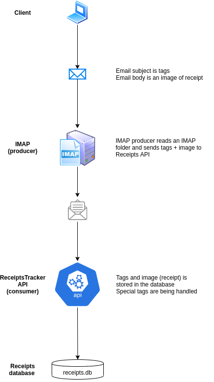

# ReceiptsTracker

## Operation
ReceiptsTracker contains two parts, the API backend which provides the endpoint
and takes care of the storing.
The another parts are the producers that send data to the ReceiptsTracker API.

The full process is depicted below

More information about the components in
[API](api/README.md)
and
[producers](producers/imap/README.md)
directories.
